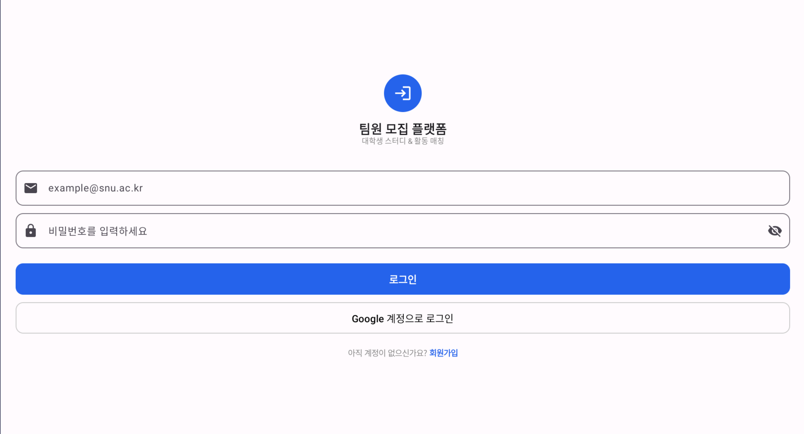
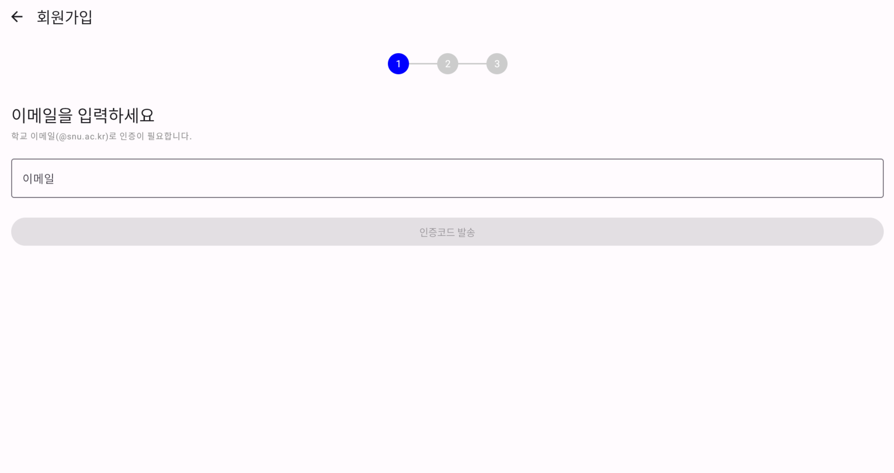
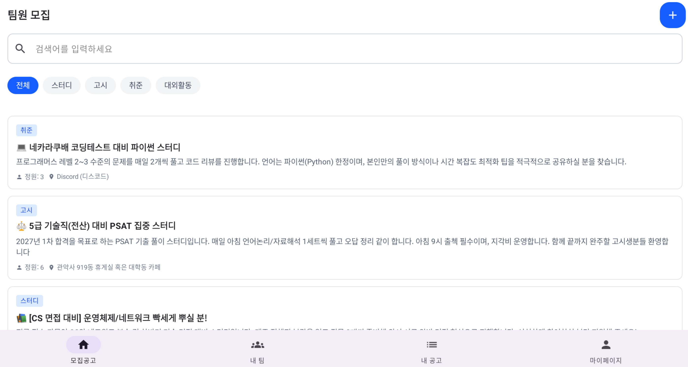
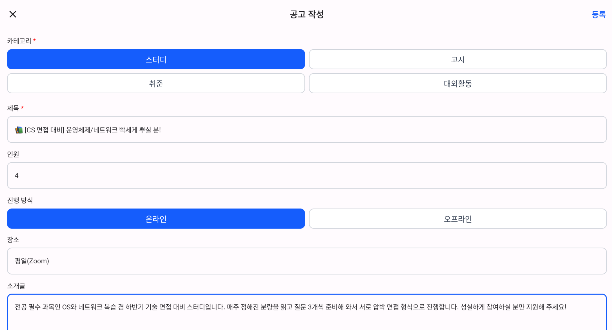
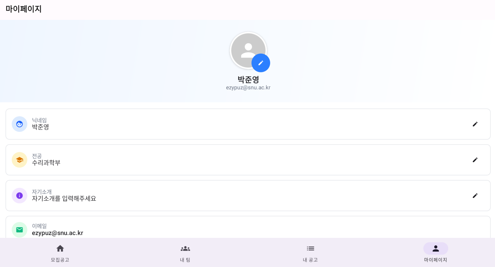
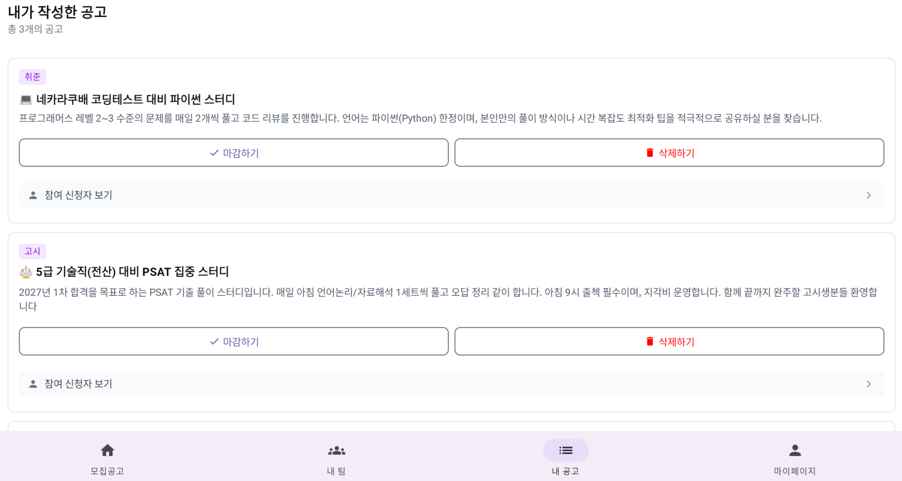
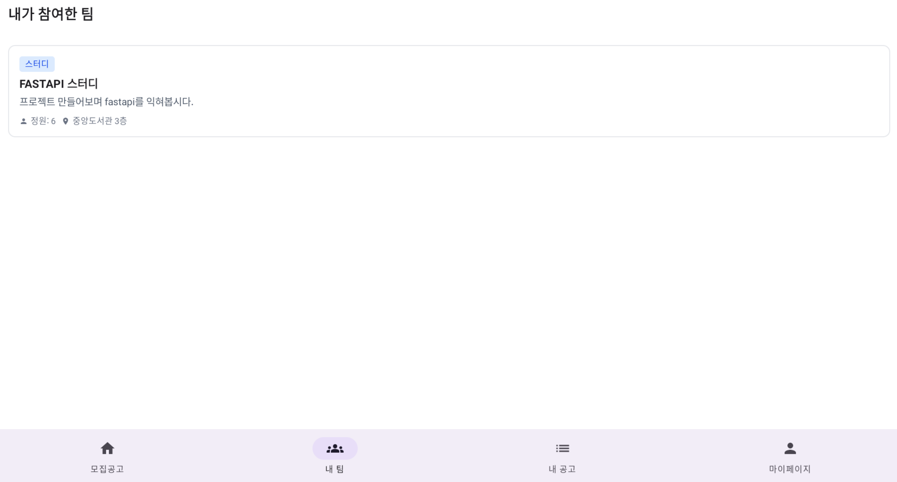

# 🚀 샤터디 (23.5-team5)
> **"대학 생활의 팀 빌딩을 더 쉽고 빠르게"** > 서울대학교 학생들을 위한 스터디 및 프로젝트 팀원 매칭 서비스 **샤터디**의 백엔드 시스템입니다.

---

## 📱 서비스 결과물 확인 (Android App)
본 서버와 연동된 안드로이드 앱의 최신 실행 파일(APK) 확인 방법을 안내드립니다.

1. **[Android 저장소 바로가기](https://github.com/wafflestudio/23-5-team5-android)**
2. 상단 **[Actions]** 탭 클릭
3. 가장 최근의 성공한(Green check) **Workflow Run**을 클릭
4. 하단 **Artifacts** 섹션에서 빌드된 **APK 파일**을 다운로드하여 설치

---

## 📝 1. 샤터디는 어떤 서비스인가요?
대학생들이 에브리타임, 카카오톡 오픈채팅방 등 파편화된 채널에서 팀원을 찾는 번거로움을 해결하기 위해 기획되었습니다. 본 서버는 사용자 인증, 팀원 모집 게시글 관리, 지원 프로세스 등 서비스의 핵심 로직을 담당합니다.

- **개발 기간:** 2025.12 ~ 2026.02
- **주요 기능:** 유저 프로필 관리, 팀 모집 게시글 CRUD, 지원 및 승인 시스템

---

## 👨‍👩‍👧‍👦 2. 팀원 소개 및 역할
| 이름      |         역할          | 담당 기능                                                                                                                                                                                     |
|:--------|:-------------------:|:------------------------------------------------------------------------------------------------------------------------------------------------------------------------------------------|
| **김시현** | **Lead / Frontend** | <li> 와이어프레임 설계<li>UI 디자인<li>groups 관련 페이지 구현 및 서버 연결                                                                                                                                      |
| **조민경** |     **Frontend**     |                                                                                                                                                                                           |
| **권성안** |     **Frontend**     | <ul><li>앱의 전체적 구조 설계<ul><li>UI, Viewmodel, Repository, Datastore 분리</li><li>NavRoute, Hilt 구현</li><li>ApiService</li></ul></li><li>첫 API, 로그인/로그아웃, 프로필 정보 관련 서버 연결 (이미지 업로드 기능 구현)</li><li>Interceptor 설정을 통한 개발 편리화</li></ul> |
| **김동현** |     **Backend**     | <li>인프라 <li> CI/CD 파이프라인 구축 <li>회원가입/로그인, 재학생 인증, 소셜로그인                                                                                                                                   |
| **박준우** |     **Backend**     | <li>엔드포인트 구현<li>ProfileService, GroupService, UserGroupService, UserSearchService, ReviewService 구현                                                                                       |
| **박준영** |     **Backend**     | <li>아키텍처 설계<li>CI/CD 파이프라인 구축<li>프로필 기능 설계                                                                                                                                                |

---

## ✨ 3. 프로젝트 뷰
### 1. 시작 페이지

### 2. 회원가입 페이지

### 3. 메인페이지

### 4. 공고 작성

### 5. 프로필

### 6. 내 공고 확인

### 7. 내가 참여한 공고

---

## 🛠 4. Tech Stack
### **Backend & Infra**
- **Language:** 
- **Framework:** 
- **Database:** 
- **Infra:**   

### **Client & Deployment (Mobile)**
- **Frontend:**  (Android)
- **Distribution:**  **APK 배포 (GitHub Actions Artifacts)**
---

## 🏃5. 시작하기 (Local Setup)

```bash
# 레포지토리 클론
git clone [https://github.com/wafflestudio/23-5-team5-server.git](https://github.com/wafflestudio/23-5-team5-server.git)

# 빌드 및 실행
./gradlew build
docker-compose up -d